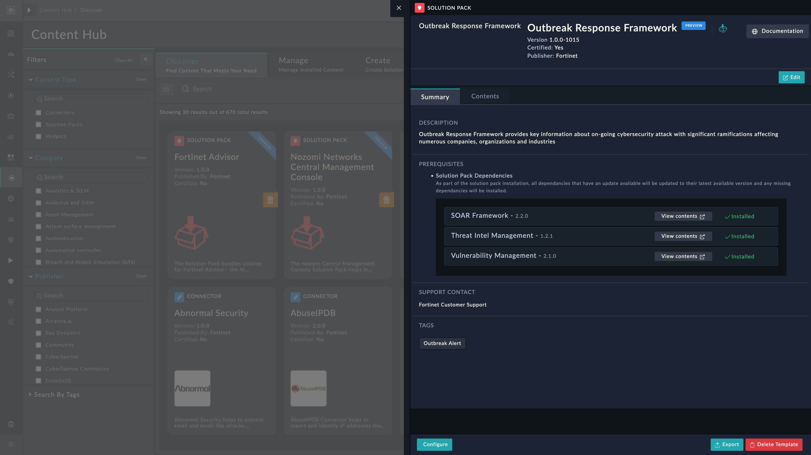
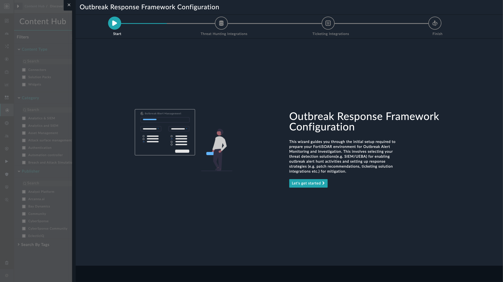
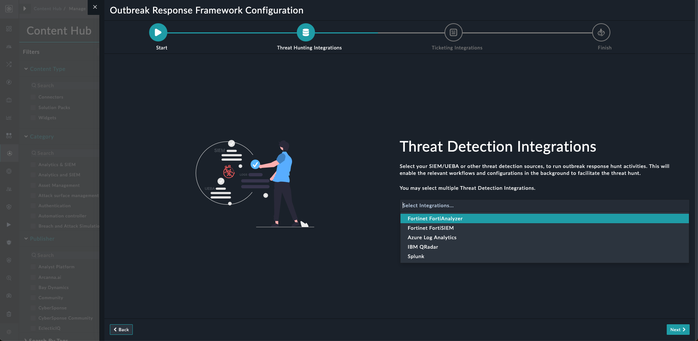
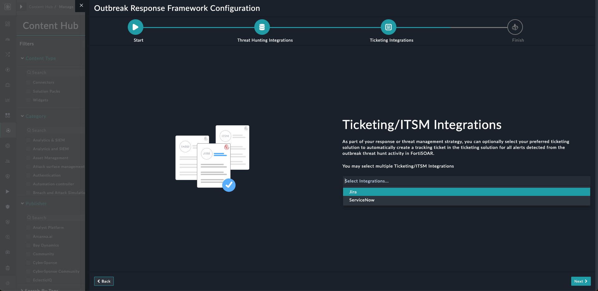
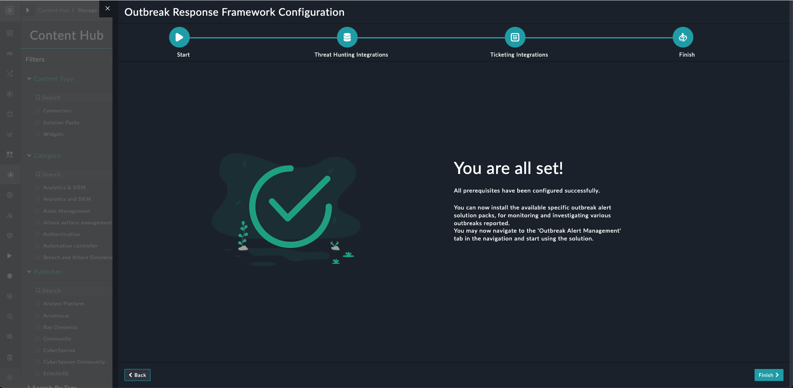

[Home](../README.md) |
|--------------------------------------------|

# Installation

1. To install a solution pack, click **Content Hub** > **Discover**.
2. From the list of solution pack that appears, search for and select **Outbreak Response Framework**.
3. Click the **Outbreak Response Framework** solution pack card.
4. Click **Install** on the lower part of the screen to begin the installation.

## Prerequisites
The **Outbreak Response Framework** solution pack depends on the following solution packs that are installed automatically &ndash; if not already installed.

| Name           | Type          | Version | Purpose                                          |
|:---------------|:--------------|:--------|:-------------------------------------------------|
| SOAR Framework | Solution Pack | v2.2.0  | Required for Incident Response modules           |
| Threat Intel Management         | Solution Pack     | v1.1.0  | Required to ingest threat feeds                   |
| Vulnerability Management     | Solution Pack     | v1.2.1  | Required to ingest CVE's for KEV's |

# Configuration

## Install and Configure Connectors
For optimal performance of **Outbreak Response Framework** solution pack, you can install and configure the connectors that help with the following:

>* **Azure Log Analytics** - Log Analytics is a tool in the Azure portal that's used to edit and run log queries against data in the Azure Monitor Logs store. This connector facilitates the automated operations related to query and saved searches.. To configure and use the Azure Log Analytics connector, refer to [Configuring Azure Log Analytics](https://docs.fortinet.com/fortisoar/connectors/azure-log-analytics)
>* **Fortinet FortiAnalyzer** - FortiAnalyzer is the NOC-SOC security analysis tool built with operations perspective. With action-oriented views and deep drill-down capabilities, FortiAnalyzer not only gives organizations critical insight into threats, but also accurately scopes risk across the attack surface, pinpointing where immediate response is required.. To configure and use the Fortinet FortiAnalyzer connector, refer to [Configuring Fortinet FortiAnalyzer](https://docs.fortinet.com/fortisoar/connectors/fortianalyzer)
>* **Fortinet FortiSIEM** - FortiSIEM provides integrations that allow you to query and make changes to the CMDB, query events, and send incident notifications. Provide actions like get incidents, comment incident, cleared incident, get device details, get monitored organizations, report related actions and get all associated events for an incident from FortiSIEM.. To configure and use the Fortinet FortiSIEM connector, refer to [Configuring Fortinet FortiSIEM](https://docs.fortinet.com/fortisoar/connectors/fortisiem)
>* **IBM QRadar** - IBM QRadar is an enterprise security information and event management (SIEM) product. Fortinet FortiSOSR connector for IBM QRadar allows user to invoke QRadar API, perform Ariel Queries and operations like Get Offense,related events,update and close offenses.. To configure and use the IBM QRadar connector, refer to [Configuring IBM QRadar](https://docs.fortinet.com/fortisoar/connectors/ibm_qradar)
>* **Fortinet FortiGate** - Fortinet FortiGate enterprise firewall provide high performance, consolidated advanced security and granular visibility for broad protection across the entire digital attack surface.. To configure and use the Fortinet FortiGate connector, refer to [Configuring Fortinet FortiGate](https://docs.fortinet.com/fortisoar/connectors/fortigate_firewall)
>* **Jira** - Jira Service Desk Connector for issue creating, updating and deleting.. To configure and use the Jira connector, refer to [Configuring Jira](https://docs.fortinet.com/fortisoar/connectors/)
>* **NIST National Vulnerability Database** - The NIST National Vulnerability Database (NVD) is the U.S. government repository of standards based vulnerability management data represented using the Security Content Automation Protocol (SCAP). This data enables automation of vulnerability management, security measurement, and compliance. The NVD includes databases of security checklist references, security related software flaws, misconfigurations, product names, and impact metrics.. To configure and use the NIST National Vulnerability Database connector, refer to [Configuring NIST National Vulnerability Database](https://docs.fortinet.com/fortisoar/connectors/nist-nvd)
>* **ServiceNow** - ServiceNow connector provides functionality to create, read, update and delete records of Table and Catalog type. To configure and use the ServiceNow connector, refer to [Configuring ServiceNow](https://docs.fortinet.com/fortisoar/connectors/servicenow-v2-0-1)
>* **Splunk** - Splunk connector allows users to invoke search, fetch events to related search, invoke alert actions, update notables, sync splunk users to FortiSOAR etc.. To configure and use the Splunk connector, refer to [Configuring Splunk](https://docs.fortinet.com/fortisoar/connectors/splunk_new)
>* **ElasticSearch** - ElasticSearch is a distributed, RESTful search and analytics engine capable of solving a number of use cases. This connector facilitates automated operations to execute lucene query, get mapping and cluster details.. To configure and use the ElasticSearch connector, refer to [Configuring ElasticSearch](https://docs.fortinet.com/fortisoar/connectors/)

## Setup Outbreak Response Framework on FortiSOAR
After installation of **Outbreak Response Framework** solution pack, run the configuration wizard to ready your FortiSOAR environment to investigate Outbreak Alerts. This wizard helps you select the configured "Threat Detection Integrations" and "Ticketing/ITSM Integrations" on FortiSOAR.

1. Log in to FortiSOAR and [after installation](#installation), click the button **Configure** from the lower-left of the screen.

    

2. Click the button **Let's get started** on the Outbreak Response Framework configuration page.

    

3. Specify Threat Detection Integrations sources to run outbreak response hunt activities. Click **Next** to proceed.

    

4. Specify Ticketing/ITSM Integrations sources as part of your response or threat management strategy. Click **Next** to proceed.

    

5. Click **Finish** to complete the configuration process.
    

## Configure the Threat Detection Integrations Parameters

Following are some prerequisites for using this solution pack:
Open "Investigate Outbreak" playbook from "10 - SP - Outbreak Response Framework" playbook collection and add following configuration parameters in set variable step for the "Threat Detection Integrations" that you have selected in configuration wizard.

- Fortinet FortiSIEM Config: 

- Fortinet FortiAnalyzer Config:

- Fortinet FortiGate Config:

- IBM QRadar Config:

- Splunk Config:

## Working with Outbreak Response Framework - Best Practices
Apart from best practices if you want to add new "Threat Detection Integrations" or "Ticketing/ITSM Integrations" after configuring the "Threat Detection Integrations" or "Ticketing/ITSM Integrations" using the Configuration Wizard, perform following pointers

1. Configure the new integration using the required credentials 
2. If you want to add "Threat Detection Integrations" then added "Threat Detection Integrations" name "Threat Hunt Tools" picklist
3. If you want to add "Ticketing/ITSM Integrations" then added "Ticketing/ITSM Integrations" name "Ticketing Tools" picklist.
4. Run "Outbreak Response Framework" configuration wizard and select the old and new added integration either in "Threat Detection Integrations" or "Ticketing/ITSM Integrations" 
5. Following global variables must never be modified or deleted:
    
    a. ticketing_integrations

    b. threat_hunt_integrations

# Next Steps
| [Usage](./usage.md) | [Contents](./contents.md) |
|---------------------|---------------------------|